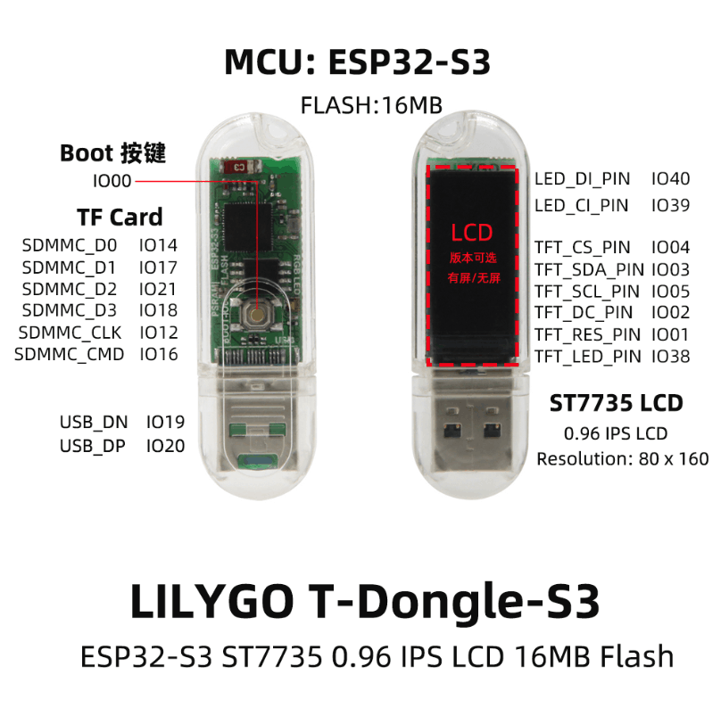
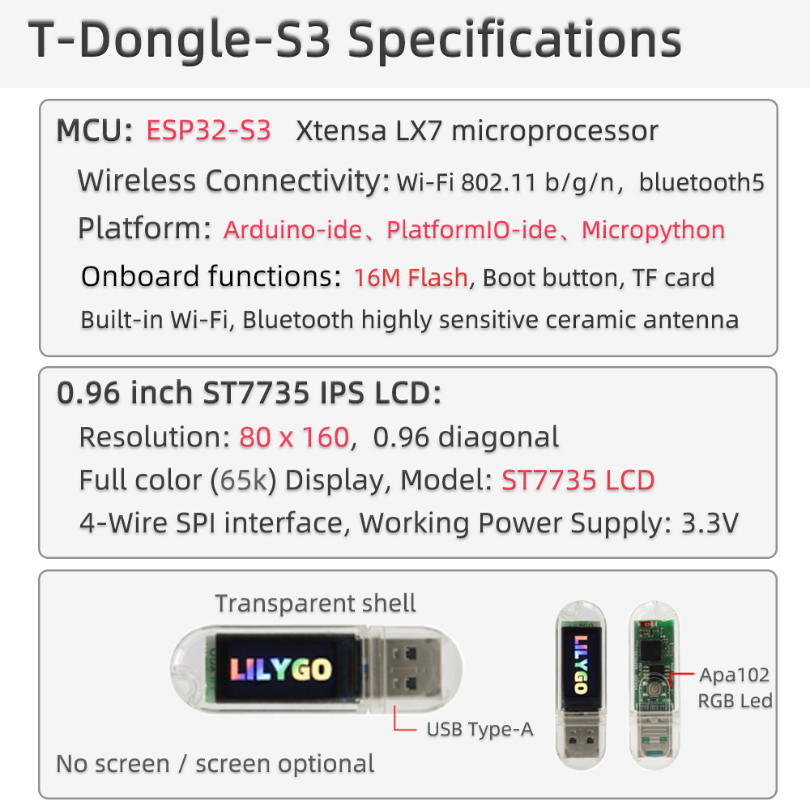

<h1 align = "center">🌟LilyGo T-Dongle-S3🌟</h1>
An ESP32S3 development board that can freely use WIFI, BLE, TF, LED, TFT_LCD functions.

# Introduce

## Product 📷

|   Product   |                            Product Link                            |
| :---------: | :----------------------------------------------------------------: |
| T-Dongle-S3 | [aliexpress](https://www.aliexpress.us/item/1005004860003638.html) |

# Quick Start
## Arduino 
> Arduino:
>- In Arduino Preferences, on the Settings tab, enter the `https://raw.githubusercontent.com/espressif/arduino-esp32/gh-pages/package_esp32_index.json` URL in the `Additional boards manager URLs` input box. **Please pay attention to the version. The test phase is using 2.0.14. It is not certain that versions above 2.0.14 can run. When the operation is abnormal, please downgrade to a version below 2.0.14.** , As of 2024/08/02, TFT_eSPI does not work on versions higher than 2.0.14, see [TFT_eSPI/issue3329](https://github.com/Bodmer/TFT_eSPI/issues/3329)

>- Copy all files in the lib folder to `\Arduino\libraries`
>- Select the settings as shown. Note that the FLASH size partition and size may be modified depending on the board.

> PlatfromIO:
> - PlatformIO plug-in installation: Click on the extension on the left column -> search platformIO -> install the first plug-in
> - Click Platforms -> Embedded -> search Espressif 32 in the input box -> select the corresponding firmware installation

> ESP-IDF:
> - The installation method is also inconsistent depending on the system, it is recommended to refer to the [official manual](https://docs.espressif.com/projects/esp-idf/en/latest/esp32/get-started/index.html) for installation

> Micropython:
> - tft_config.py is already built into the firmware. The examples in the examples directory can be used directly.
> - For detailed function query, please refer to the following link.
> - [[Micropython doc](https://docs.micropython.org/en/latest/index.html)]

## Tips

- The program can be written normally, but there is still no display after writing
    1. There are factory test files in the firmware folder, which can be flashed into the board to check whether the board is normal. If there is still no display, then it can be judged that there is a problem with the board or the screen
    2. Delete the <TFT_eSPI> in the libraries, and replace the <TFT_eSPI> in the <lib> folder of the main page to the libraries directory
    3. When opening the Arduino IDE, it prompts whether to upgrade the library, please choose not to upgrade, otherwise it will overwrite the configuration of the <TFT_eSPI> display

## FAQ

1. The program can be written normally, but there is still no display after writing
   1. There are factory test files in the firmware folder, which can be flashed into the board to check whether the board is normal. If there is still no display, then it can be judged that there is a problem with the board or the screen
   2. Delete the <TFT_eSPI> in the libraries, and replace the <TFT_eSPI> in the <lib> folder of the main page to the libraries directory
   3. When opening the Arduino IDE, it prompts whether to upgrade the library, please choose not to upgrade, otherwise it will overwrite the configuration of the <TFT_eSPI> display

2. The board uses USB as the JTAG upload port. When printing serial port information on USB_CDC_ON_BOOT configuration needs to be turned on. 
If the port cannot be found when uploading the program or the USB has been used for other functions, the port does not appear. 
Please enter the upload mode manually. 
   1. Press and hold the BOOT button , While still pressing the BOOT button, Insert USB
   2. Release the BOOT button
   3. Upload sketch

3. If the above is invalid, burn the [binary file](./firmware/README.MD)  to check whether the hardware is normal