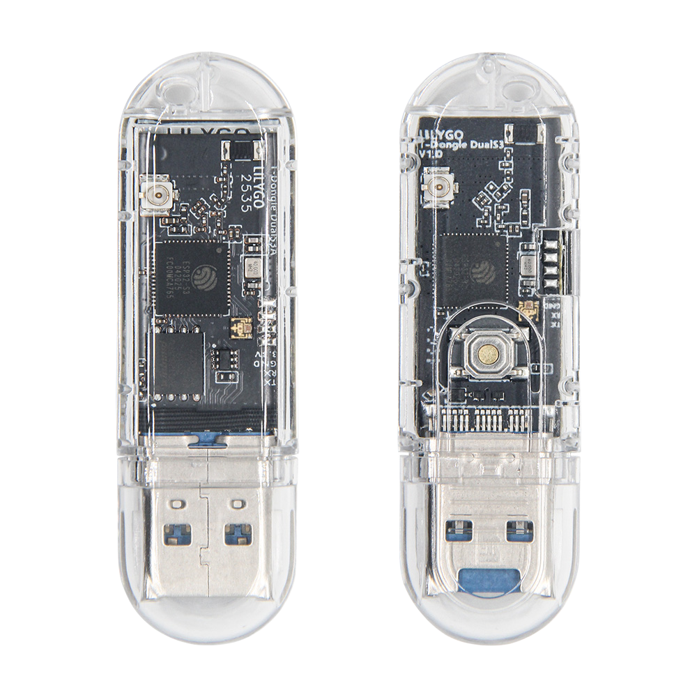
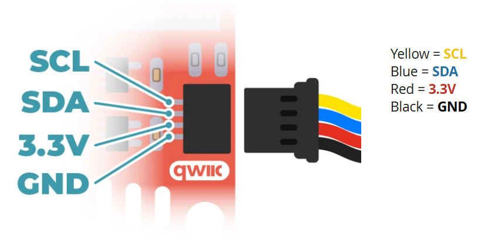

  

<h1 align = "center">🌟LilyGo T-Dongle-S3-Dual🌟</h1>

## Overview

* This page introduces the hardware parameters related to `LilyGo T-Dongle-S3-Dual`

  

### Product

| Product               | SOC             | Flash          | SRAM   | PSRAM    |
| --------------------- | --------------- | -------------- | ------ | -------- |
| [T-Dongle-S3-Dual][1] | ESP32-S3(Core1) | 16MB(Quad-SPI) | 512 KB | No PSRAM |
|                       | ESP32-S3(Core2) | 16MB(Quad-SPI) | 512 KB | No PSRAM |

[1]: https://lilygo.cc/products/t-dongle-s3

### PlatformIO Quick Start

1. Install the **CH34x USB bridge** driver for the first time.
   * [Windows](https://www.wch-ic.com/downloads/CH343SER_ZIP.html)
   * [Mac OS](https://www.wch-ic.com/downloads/CH34XSER_MAC_ZIP.html)
2. Install [Visual Studio Code](https://code.visualstudio.com/) and [Python](https://www.python.org/)
3. Search for the `PlatformIO` plugin in the `Visual Studio Code` extension and install it.
4. After the installation is complete, you need to restart `Visual Studio Code`
5. After restarting `Visual Studio Code`, select `File` in the upper left corner of `Visual Studio Code` -> `Open Folder` -> select the `T-Dongle-S3` directory
6. Wait for the installation of third-party dependent libraries to complete
7. Click on the `platformio.ini` file, and in the `platformio` column
8. Cancel the `;` symbol in front of the line `default_envs = T-Dongle-S3-Dual` and use `T-Dongle-S3-Dual` as the default environment
9. Uncomment one of the lines `src_dir = xxxx` to ensure that only one line is valid. For example, to enable `src_dir = examples/factory_no_screen`, remove the leading `;` symbol and save the file. The `factory_no_screen` example will now be compiled.
10. Click the (✔) symbol in the lower left corner to compile
11. Plug the device into the USB port.
12. Click (→) to upload firmware
13. Click (plug symbol) to monitor serial output

> \[!IMPORTANT]
>
> If the firmware upload fails, press and hold the BOOT button on the T-Dongle-S3 while plugging it into your computer's > USB port. The device will enter download mode.
>
> After the download is complete, unplug the device and power it back on. Do not press the BOOT button while powering > on, otherwise the device will remain in download mode.
>
> If you change the USB mode to USB-OTG (TinyUSB) mode during the upload process, you must manually put the device into download mode before the device will be allowed to upload the new firmware.
>
> It's impossible to distinguish between Core1 and Core2 based on port numbers alone; only testing whether the SD card mount is successful can determine which port is Core1.
>

### Arduino IDE quick start

1. Install the **CH34x USB bridge** driver for the first time.
   * [Windows](https://www.wch-ic.com/downloads/CH343SER_ZIP.html)
   * [Mac OS](https://www.wch-ic.com/downloads/CH34XSER_MAC_ZIP.html)
2. Install [Arduino IDE](https://www.arduino.cc/en/software)
3. Install the [ESP32 core, version 3.3.0 or higher](https://docs.espressif.com/projects/arduino-esp32/en/latest/)
4. Copy all folders in the `lib` directory to the `Sketchbook location` directory. How to find the location of your own libraries, [please see here](https://support.arduino.cc/hc/en-us/articles/4415103213714-Find-sketches-libraries-board-cores-and-other-files-on-your-computer)
    * Windows: `C:\Users\{username}\Documents\Arduino`
    * macOS: `/Users/{username}/Documents/Arduino`
    * Linux: `/home/{username}/Arduino`
5. Open the corresponding example
    * Open the downloaded `T-Dongle-S3`
    * Open `examples`
    * Select the sample file and open the file ending with `ino`
6. On Arduino ISelect the corresponding board in the DE tool project and click on the corresponding option in the list below to select

    | Name                                 | Value                               |
    | ------------------------------------ | ----------------------------------- |
    | Board                                | **ESP32S3 Dev Module**              |
    | Port                                 | Your port                           |
    | USB CDC On Boot                      | Enable                              |
    | CPU Frequency                        | 240MHZ(WiFi)                        |
    | Core Debug Level                     | None                                |
    | USB DFU On Boot                      | Disable                             |
    | Erase All Flash Before Sketch Upload | Disable                             |
    | Flash Mode                           | QIO 80Mhz                           |
    | Flash Size                           | **16MB(128Mb)**                     |
    | Arduino Runs On                      | Core1                               |
    | USB Firmware MSC On Boot             | Disable                             |
    | Partition Scheme                     | **16M Flash (3MB APP/9.9MB FATFS)** |
    | PSRAM                                | **Disabled**                        |
    | Upload Speed                         | 921600                              |
    | Programmer                           | **Esptool**                         |
    | USB Mode                             | **Hardware CDC and JTAG**           |

     * `Partition Scheme` Please select according to the actual application. For example, select **16M Flash (3MB APP/9.9MB FATFS)** , For more partitioning schemes, please see [here](https://docs.espressif.com/projects/esp-idf/en/stable/esp32/api-guides/partition-tables.html)
     * `USB Mode` Choose according to the different examples; the default is Hardware CDC and JTAG. When using the example with the USB name, change to **USB-OTG(TinyUSB)** mode.

7. Upload sketch

> \[!IMPORTANT]
>
> If the firmware upload fails, press and hold the BOOT button on the T-Dongle-S3 while plugging it into your computer's > USB port. The device will enter download mode.
>
> After the download is complete, unplug the device and power it back on. Do not press the BOOT button while powering > on, otherwise the device will remain in download mode.
>
> If you change the USB mode to USB-OTG (TinyUSB) mode during the upload process, you must manually put the device into download mode before the device will be allowed to upload the new firmware.
>
> It's impossible to distinguish between Core1 and Core2 based on port numbers alone; only testing whether the SD card mount is successful can determine which port is Core1.
>
>

### 📍 ESP Core 1 Pins Map

| Name              | GPIO NUM |
| ----------------- | -------- |
| Core 1  RGB DIN   | 40       |
| Core 1  RGB CLK   | 39       |
| Core 1  SDMMC D0  | 14       |
| Core 1  SDMMC D1  | 17       |
| Core 1  SDMMC D2  | 21       |
| Core 1  SDMMC D3  | 18       |
| Core 1  SDMMC CLK | 12       |
| Core 1  SDMMC CMD | 16       |
| Core 1  Button    | 0        |

### 📍 ESP Core 2 Pins Map

| Name            | GPIO NUM |
| --------------- | -------- |
| Core 2  RGB DIN | 40       |
| Core 2  RGB CLK | 39       |

### ⚡ Electrical parameters

| Features                 | Details   |
| ------------------------ | --------- |
| 🔗USB input voltage range | 4.8V~5.5V |
| ⚡USB Max Current         | 1000mA    |

<!-- ### QWIIC Connector

* The QWIIC interface is configured for serial port functionality by default. If you want to use it for I2C functionality, you need to add a pull-up resistor to the external sensor.
* Examples:
    - [QWIIC I2C example](../../../examples/qwiic_i2c_scan/qwiic_i2c_scan.ino)
    - [QWIIC Uart example](../../../examples/qwiic_uart_loopback/qwiic_uart_loopback.ino) -->

### Button Description

| Button | Function                            |
| ------ | ----------------------------------- |
| BOOT   | Customizable function/Download mode |

* Press and hold the `BOOT` button before powering on. The board is now in waiting mode for downloading.

<!-- ### Antenna Description -->

### LED Description

| RGB LED                                                   | Color Order |
| --------------------------------------------------------- | ----------- |
| [APA102](../../../datasheet/APA102%202020%20256%206A.pdf) | BGR         |

### Resource

* [T-Dongle-S3 Dual Schematic](../../../schematic/T-Dongle-DualS3.pdf)
* [Case](../../../case/README.MD)
