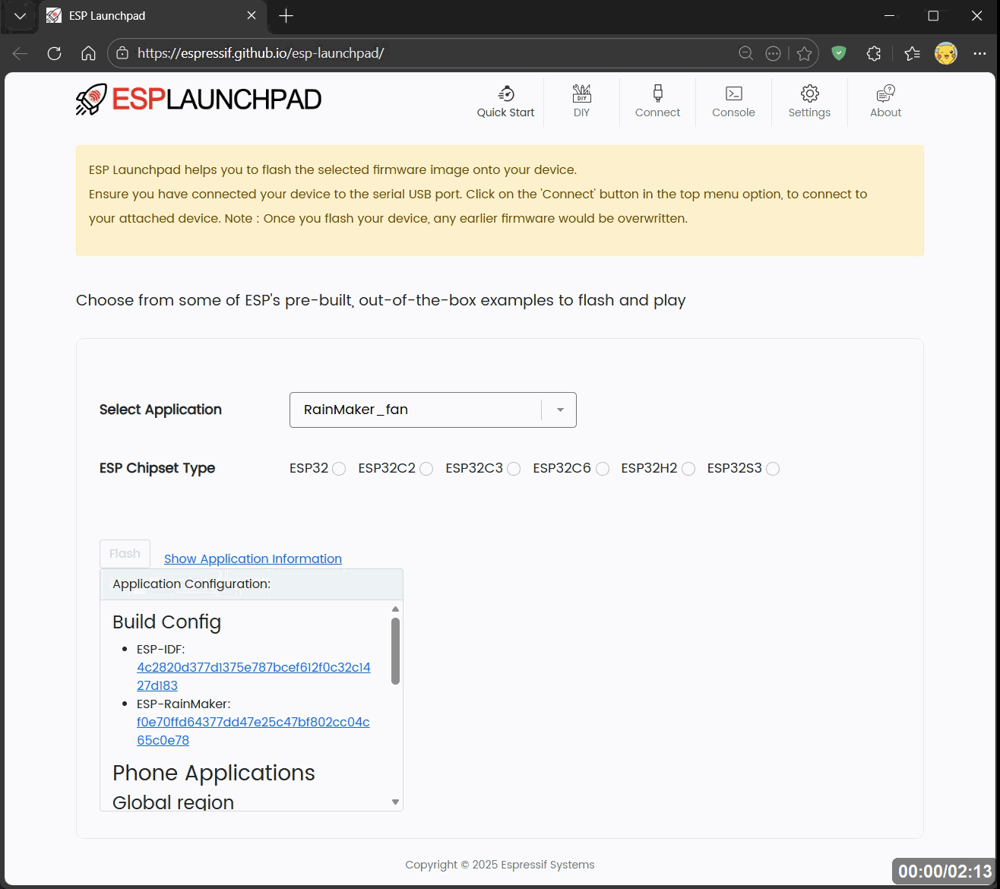
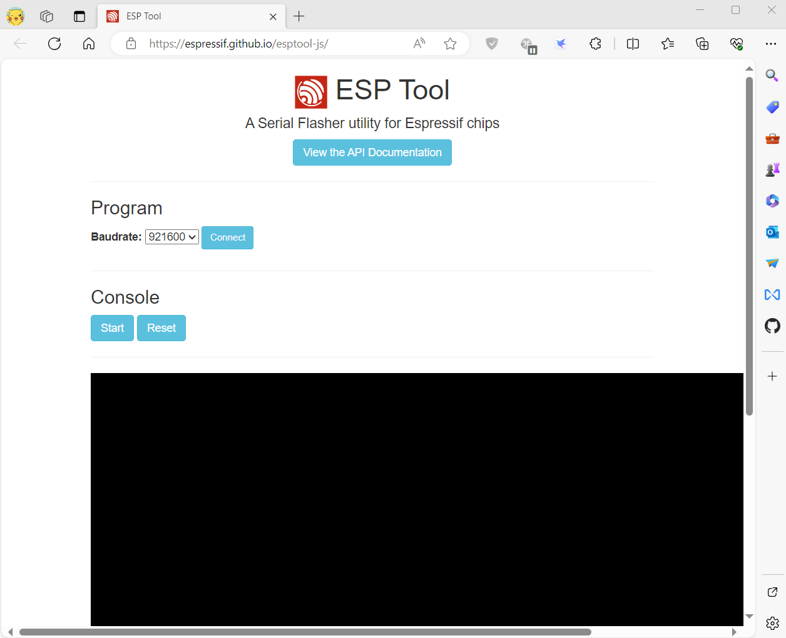

# How to flash firmware

## 1. Use bat script

* Double click Flash T-Dongle-S3.bat flash firmware to T-Dongle-S3
* Double click Flash T-Dongle-S3-Plus.bat flash firmware to T-Dongle-S3-Plus

## 2. ESP-Launchpad Online

- [Esp-launchpad](https://espressif.github.io/esp-launchpad/)



* Note that after writing is completed, You need to unplug and replug the device.

### 3. Use ESP Download Tool

- Download [Flash_download_tool](https://dl.espressif.com/public/flash_download_tool.zip)


* Note that after writing is completed, You need to unplug and replug the device.

### 4. Use Web Flasher

- [ESP Web Flasher Online](https://espressif.github.io/esptool-js/)



* Note that after writing is completed, You need to unplug and replug the device.

### 5. Use command line


If system asks about install Developer Tools, do it.

```bash
python3 -m pip install --upgrade pip
python3 -m pip install esptool
```

In order to launch esptool.py, exec directly with this:

```bash
python3 -m esptool
```

For ESP32-S3 use the following command to write

```bash
esptool --chip esp32s3  --baud 921600 --before default_reset --after hard_reset write_flash -z --flash_mode dio --flash_freq 80m 0x0 firmware.bin

```
